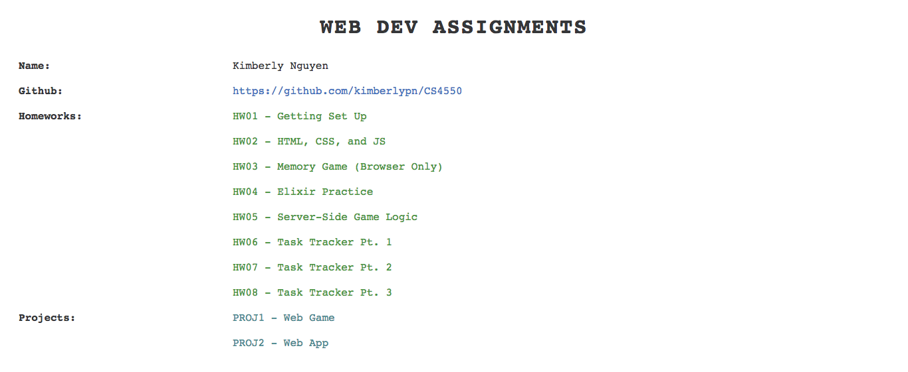

# CS4550 Web Development (Spring 2018)
**Main Website**: www.kimberlynguyen.solutions 

  - **UPDATE**: My domain has now been taken down. I may work on re-deploying everything in the future.

**Course Website**: http://www.ccs.neu.edu/home/ntuck/courses/2018/01/cs4550/ 
 

This repository contains all of my assignments for CS4550 Web Development.

## Homeworks
- [HW01 - Getting Set Up](http://hw01.kimberlynguyen.solutions/)  
- [HW02 - HTML, CSS, and JS](http://hw02.kimberlynguyen.solutions/)
- [HW03 - Memory Game (Browser Only)](https://github.com/kimberlypn/CS4550/tree/v1.0/memory)
- [HW04 - Elixir Practice](https://github.com/kimberlypn/CS4550/tree/master/calc)
- [HW05 - Server-Side Game Logic](http://memory.kimberlynguyen.solutions)
- [HW06 - Task Tracker Pt. 1](http://tasks1.kimberlynguyen.solutions)
- [HW07 - Task Tracker Pt. 2](http://tasks2.kimberlynguyen.solutions)
- [HW08 - Task Tracker Pt. 3](http://tasks3.kimberlynguyen.solutions)

## Projects
- [Project 1 - Web Game](http://shambomon.kimberlynguyen.solutions/)  
- [Project 2 - Web App](http://travelpal.kimberlynguyen.solutions/)  

## Main Website

