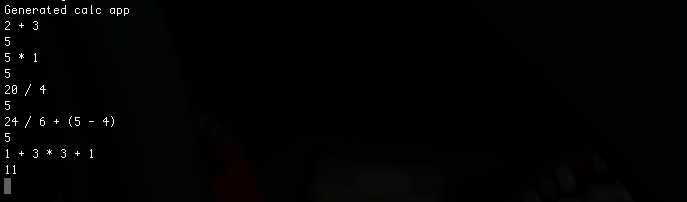

# Calc

## To Do
- Calc.eval (String -> Number) # Should parse and evaluate an arithmetic expression  
- Calc.main # Should repeatedly print a prompt, read one line, eval it, and print the result
- Write tests for the public functions in the calc module

Below is an example screenshot of the console when the calculator is run. 

