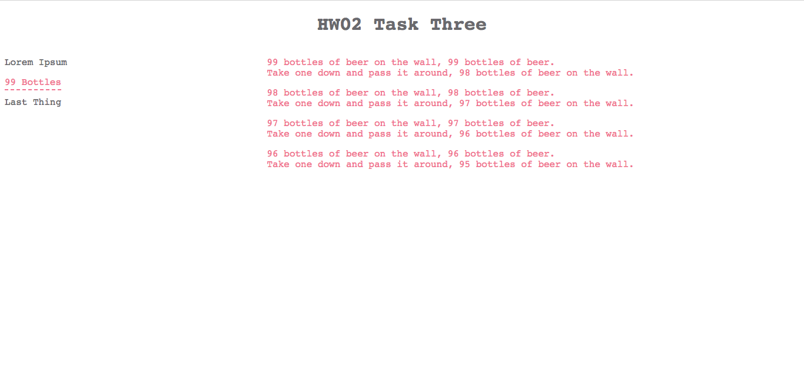

# HW02 - HTML, CSS, and JS  

## [Index](index.html) 
The index page provides links to the three tasks that I had to complete. 
 

## [Task 1](task1.html)
For the first task, I had to create a page with the name of an animal as a 
header, where each letter is a different color, include a picture of the 
animal, add links to three different pages, and create a table of the first 
eight powers of two. 
 

## [Task 2](task2.html)
For the second task, I had to create a page with a header starting at the 
number ten and three buttons. One button alerts the user of the current number, 
another button increments the number by one, and the last button appends a new 
paragraph containing the number to the bottom of the page. 
 
 
 

## [Task 3](task3.html)
For the third task, I had to create two columns, where each link in the left 
column toggles some text in the right column. 
 
 
 
