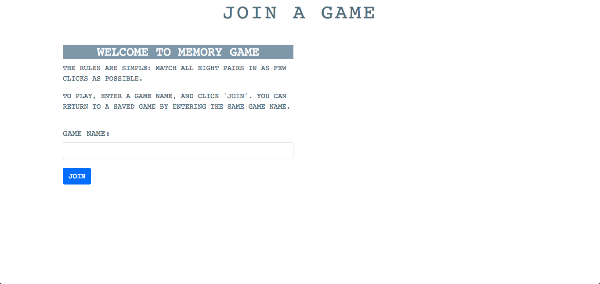
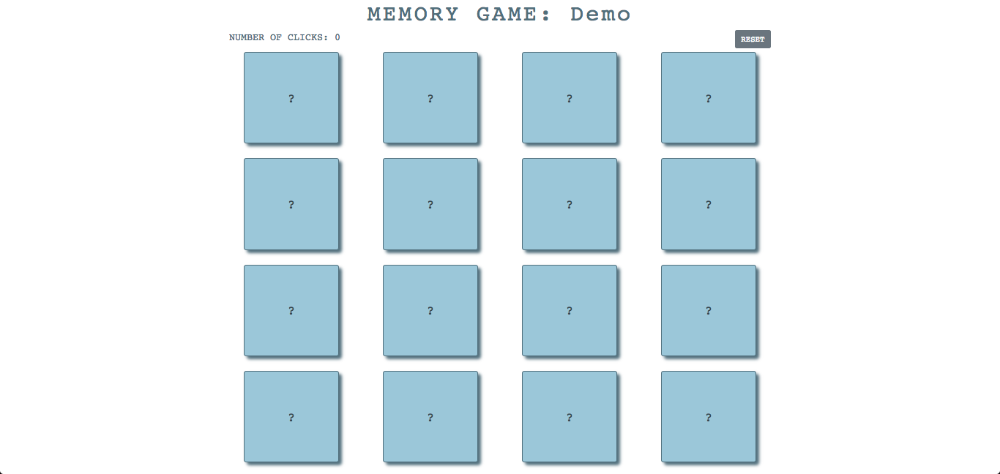
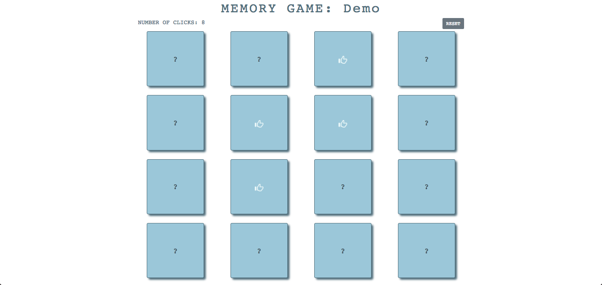
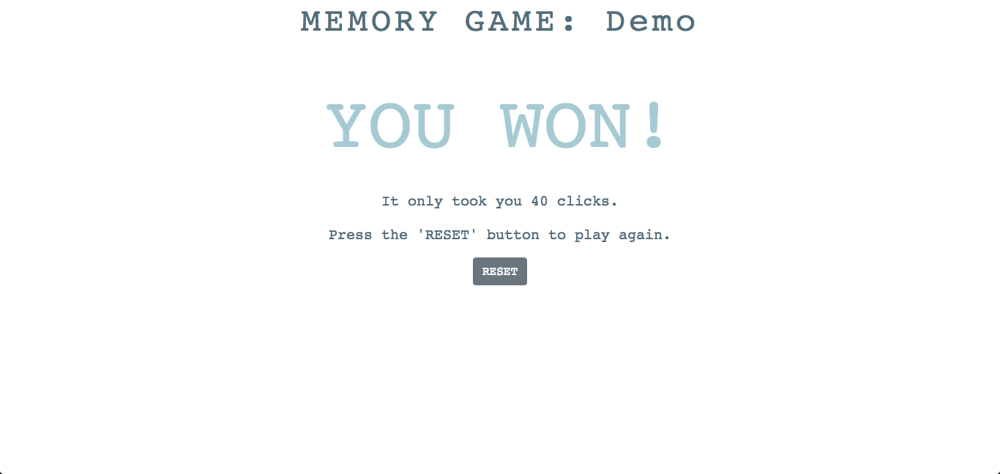

# Memory Game

## Creating a Game
When users first visit the home page, they will be prompted for a game name. 
Users can return to a saved game at any point by entering the same game name. 

## Gameplay
After entering a game name, the game will start. There is a 4x4 grid of cards, 
and behind each card is a letter in the range A-H. The goal of the game is to 
match all eight pairs in as few clicks as possible. 

When users get a match, they will see a thumbs-up icon on both cards. The 
number of cards that the user has clicked is tracked in the top-left. Clicking 
a card that has already been matched does not increment the click count. 

Once users have matched all eight pairs, they will see a "You Won!" message 
with their click count, which is their score, and a button to reset the game. 

