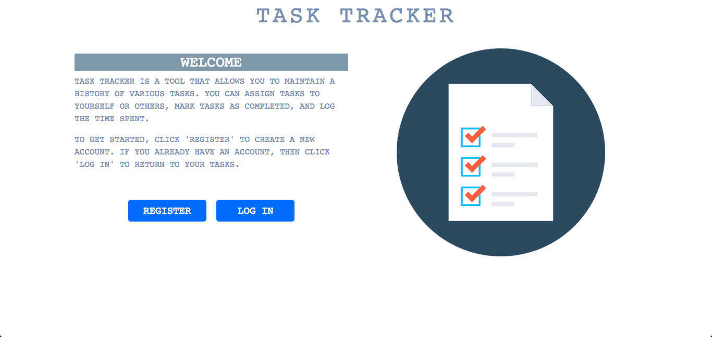
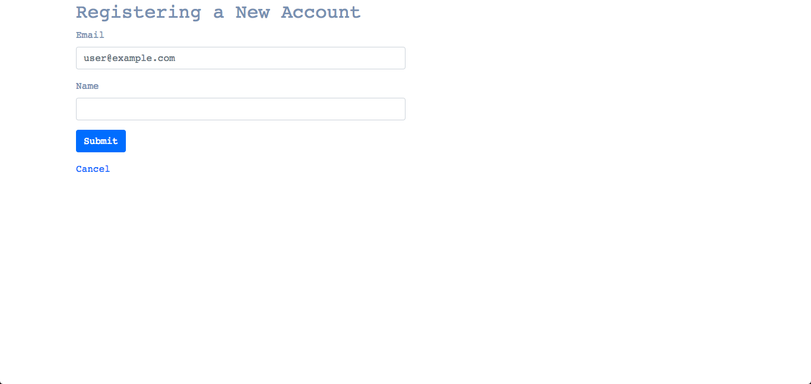
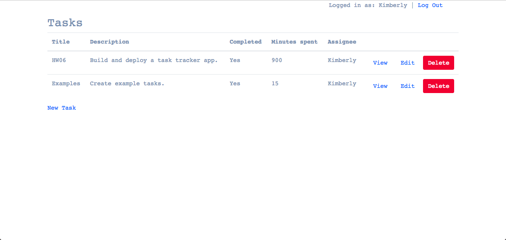
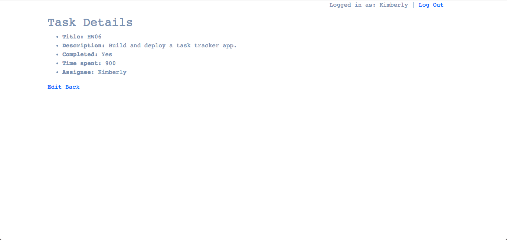
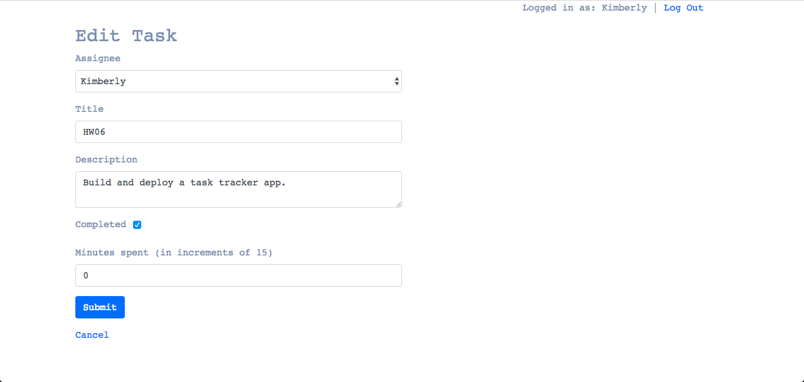
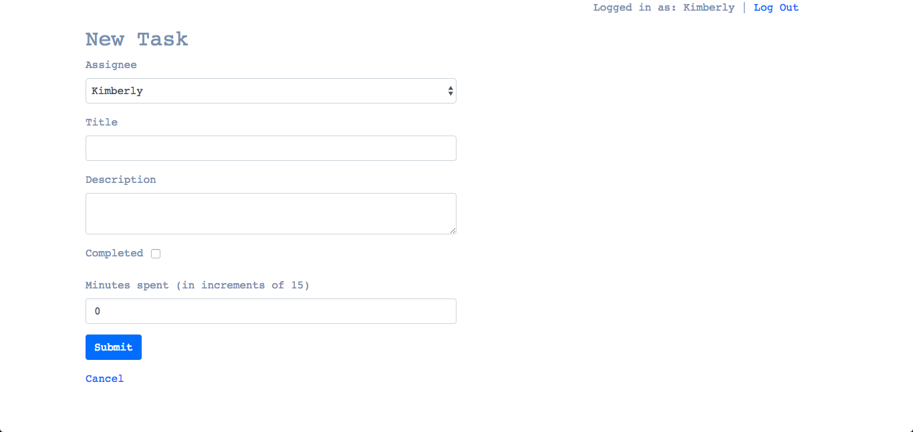
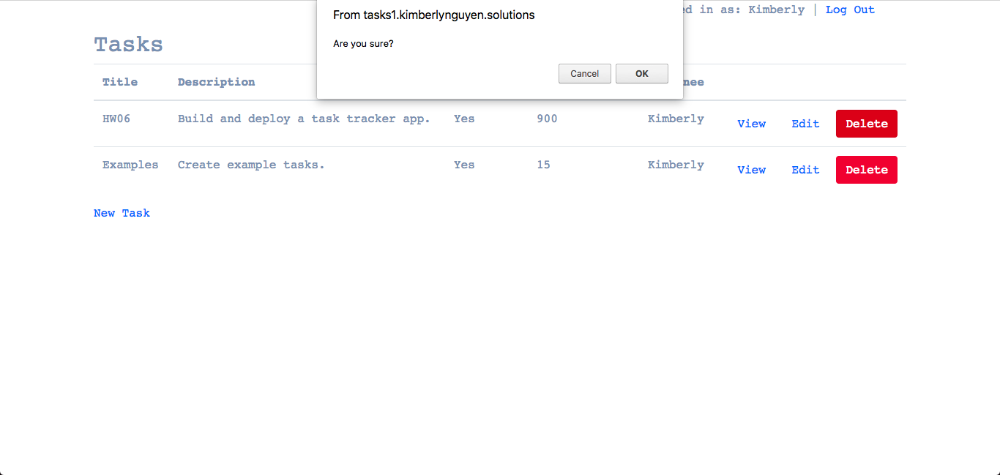
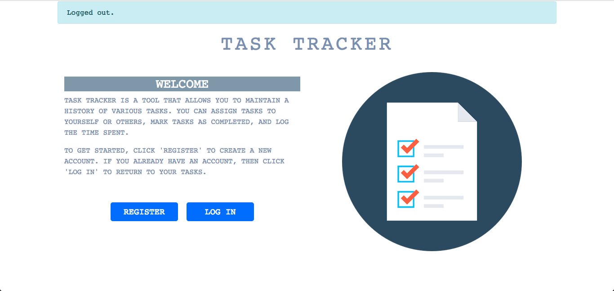

# Task Tracker
## Part 1
On the home page, there is a button to register an account. As of now, the user
only needs to input a name and a unique email. The email needs to be unique
since it is used to log in, and the server will throw an error if the user tries
to register an email that is already in the database. It will also throw an
error if either field is left blank. Once the account has successfully been
created, the user is redirected to the home page, where she can then log in via
her email. The server will throw an error message if the email entered is not in
the database.

After logging in, the user is able to view all tasks that have been created. The
user can create a new task by clicking the 'New Task' link at the bottom left of
the table. By default, the task is assigned to the user, but she can use the
dropdown menu to choose a different user. The server will throw an error if any
of the fields are left blank. However, the 'completed' and 'time_spent' fields
have a default of false and 0, respectively. If the user wants to change the
minutes spent, it must be in increments of 15, which the server will validate
before saving to the database. After filling in all of the fields and clicking
the 'Submit' button, the user is redirected to the tasks index page, where she
can choose to edit or view any tasks. Once done, the user can log out via the
link in the top right. 

## Workflow
When users first visit the homepage, they will be prompted with a log-in form. 
 

If users do not have an account, they can use the "Register" button to create 
one. This link will redirect them to a registration form. 
 

After logging in, users will see their list of tasks. 
 

Users can view the details of an individual task by clicking the "View" link 
beside the task. 
 

Users can edit the details of an individual task by clicking the "Edit" link 
beside the task. This link will redirect them to an edit form. 
 

Users can create a new task by clicking the "New Task" link in the bottom-left. 
This link will redirect them to a new task form. 
 

Users can delete an individual task by clicking the "Delete" button beside the 
task. The user will be asked to confirm the deletion upon clicking this button. 
 

Users can log out by clicking the "Log Out" link in the top-right. After 
logging out, the user will be redirected back to the homepage. 
 