# Task Tracker
## Part 2
Registration and logging in is the same as in [Part 1](https://github.com/kimberlypn/CS4550/blob/master/tasks1/README.md).

After logging in, the user has access to two new links in the top left: 'Task
Report' and 'Profile'. On the Task Report page, the user can see a table of
tasks assigned to herself and her underlings and the status of those tasks. If
the user has at least one underling, then she will be able to add a new task via
the link at the bottom left. Users who are not managers are not able to create
tasks, but they can still view tasks assigned to them. However, only managers
can edit or delete tasks. For each task assigned to the current user, the user
will also see a 'Start' and 'End' button. When the user clicks 'Start', the
link will change to 'In Progress' to let the user know that the button has been
clicked. This will create a new TimeBlock record, where the start time is the
time at which the user clicked 'Start', and the end time is null. Once the user
clicks 'End', the record will get updated with the end time, and the 'In
Progress' text will turn back to 'Start' so that the user can track another
block. If the user tries to press 'End' before pressing 'Start', she will be
prompted with a message informing her that she has to start the task first.
For now, if the user clicks 'Start', then she must stay on the page in order to
'End' that task; otherwise, the timer will restart. This is something that needs
to be fixed, but the required functionality is there so long as the user stays
on the page.

When the user first creates a task, she will be able to enter the start and end
times for the task. This is useful in the case where a user does extra work that
was not assigned by the manager, and the manager wanted to keep track of this
completed task for future reference. If the start time is greater than the end
time, the task will still get created if all of the required fields have been
filled in, but the timeblock will not get created. When the user tries to edit
a task, there will not be an input for the start and end times because a single
task can have multiple timeblocks, so editing timeblocks is maintained as a
separate form, which the user can access via the 'View Log' link (see below).

The user will be able to view the time logs for any task by clicking the 'View
Log' link. This will redirect the user to a new page that has a table of all of
the start and end times for that task. The user can click the 'Edit' link beside
each timeblock if she needs to change any of the values. There is also a
'Delete' button beside each timeblock, which the user can click to remove an
entry.

On the Profile page, the user can see her manager and underling details. The
user can add more users to manage or unmanage current underlings by clicking the
'Edit' link at the bottom left. When editing, the user can only see her current
underlings and any users who do not have a manager (i.e., users who are being
managed by someone else will not appear in this table since each user can only
have one manager). The user can use the 'Manage'/'Unmanage' button beside each
user to respectively manage or unmanage that user.

I have added myself, all of the TAs, and the professor to the production
database already so that there are available users to test on when grading.
Also, side note: the datetime input is, unfortunately, not supported on Firefox,
so it would be easier to create timeblocks on Google Chrome.

## Workflow
When users first visit the homepage, they will be prompted with a message
telling them to log-in.
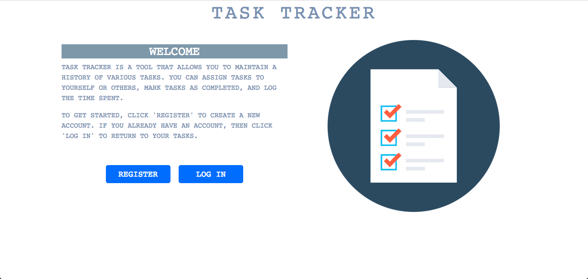

If users do not have an account, they can use the "Register" button to create
one. This button will redirect them to a registration form.
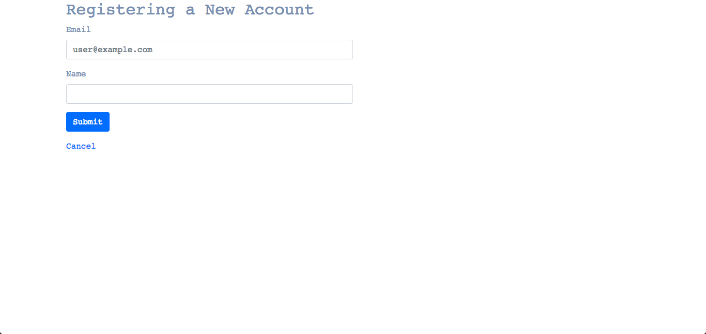

If users do have an account, they can use the "Log In" button to log in.
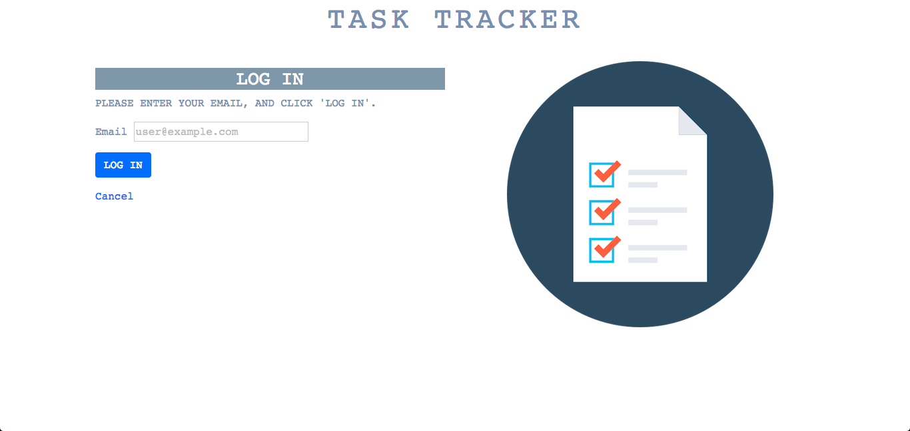

After logging in, users will see their task report.
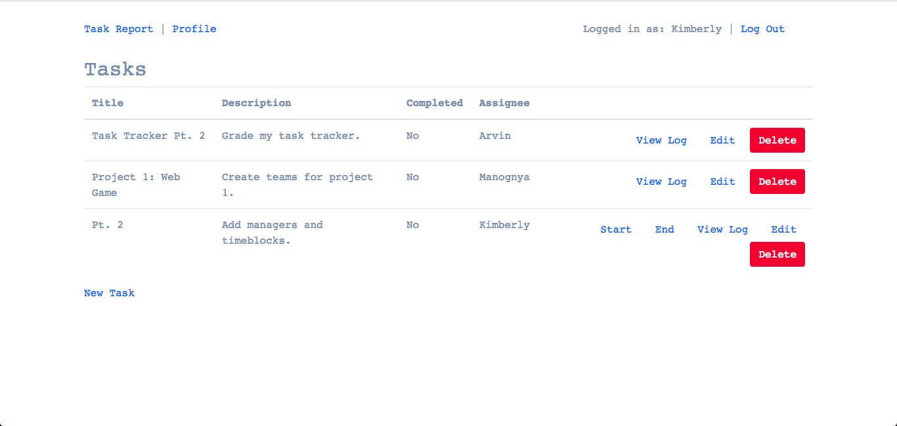

Tasks that are assigned to the user have two additional links: "Start" and
"End". These links allow users to enter the time spent as multiple pairs of
(start, end) timestamps rather than having to enter both values at once. After
clicking "Start", the text will change to "In Progress".
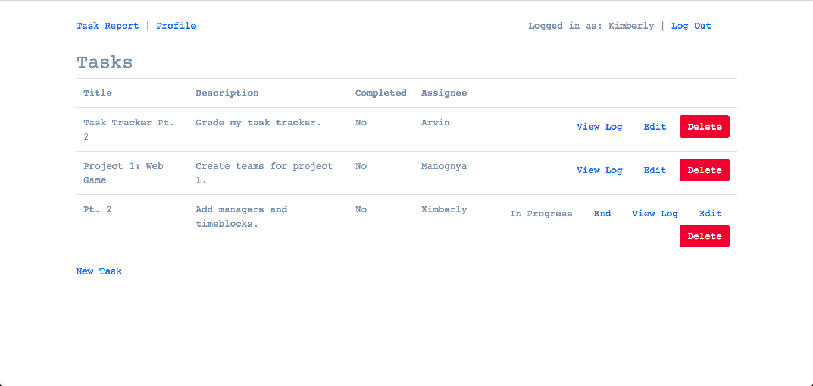

The "View Log" link allows users to see the time log for an individual task.
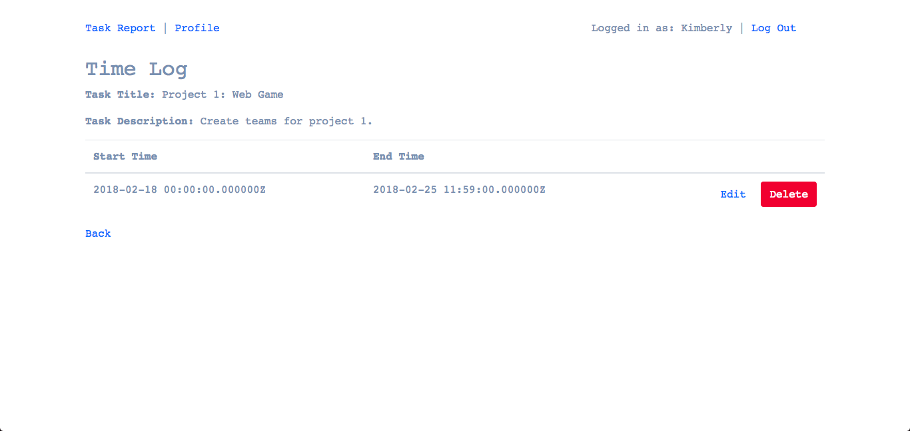

Users can edit a specific time log entry by clicking the "Edit" link beside the
entry. This toggles the edit timeblock form. There is also a "Delete" button
that users can click to delete an individual timeblock.
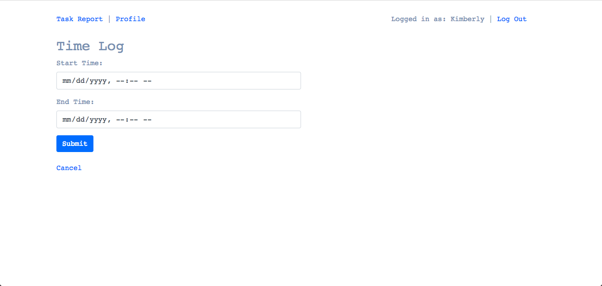

Back on the task report page, users can edit the details of an individual task
by clicking the "Edit" link beside the task. This link will redirect them to an
edit task form.
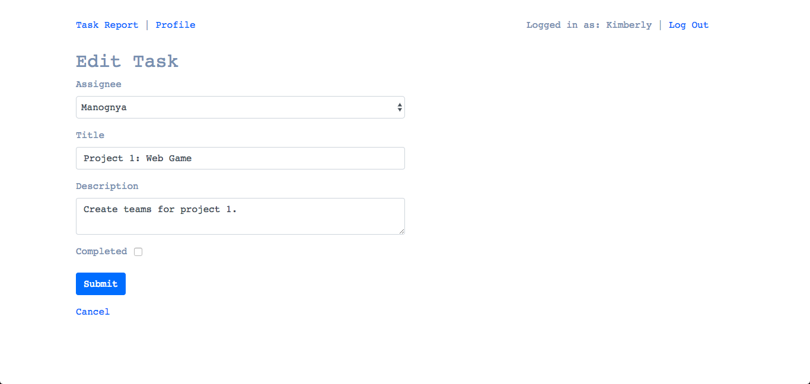

Users can delete an individual task by clicking the "Delete" button beside the
task. Users will be asked to confirm the deletion upon clicking this button.
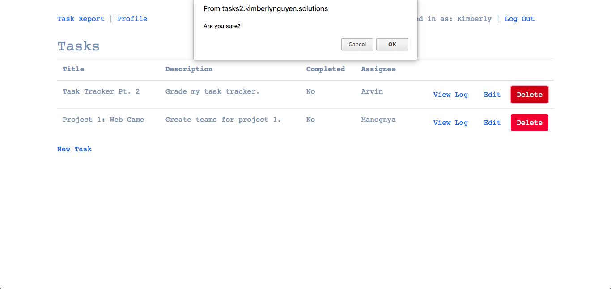

Users can create a new task by clicking the "New Task" link in the bottom-left.
This link will redirect them to a new task form.
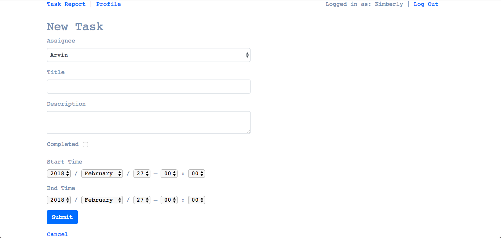

Beside the "Task Report" link in the navigation bar is a "Profile" link. Here,
users can view their manager and the users that they manage.
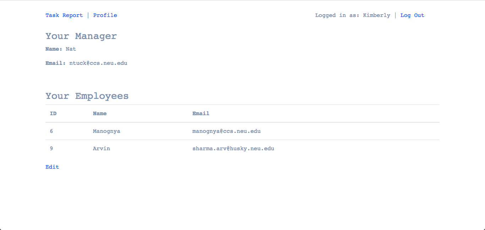

Users can manage/unmanage other users by clicking the "Edit" link in the
bottom-left.
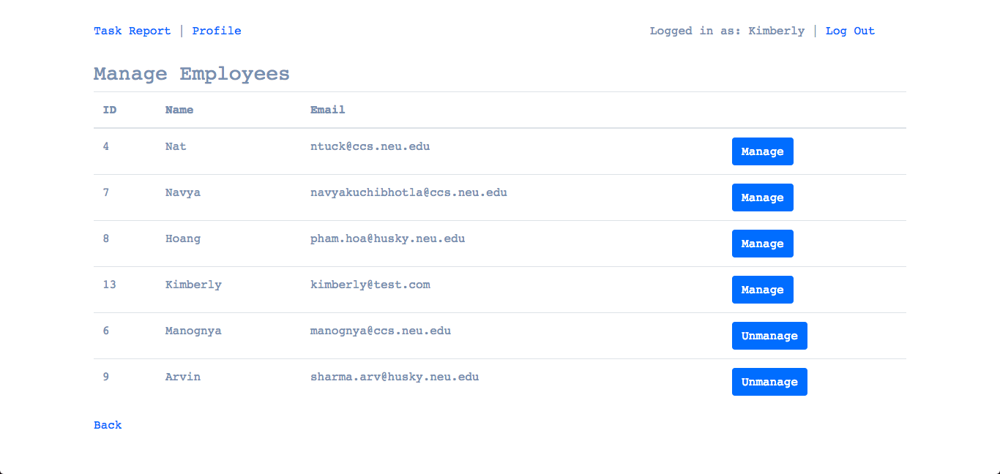

Users can log out by clicking the "Log Out" link in the top-right. After
logging out, users will be redirected back to the homepage.
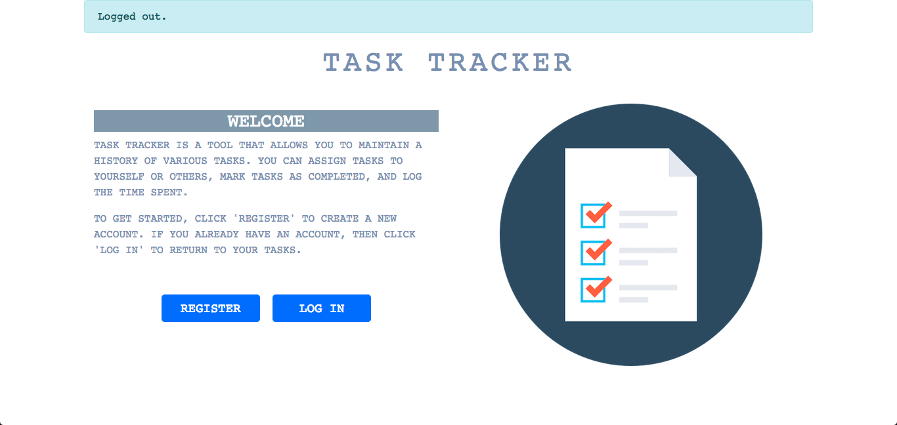
